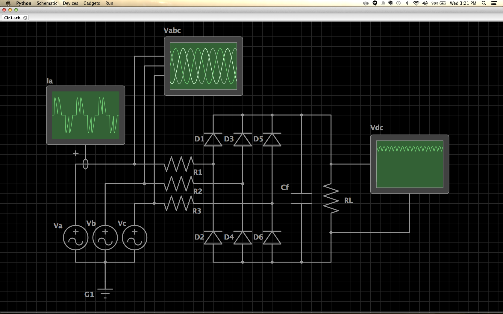
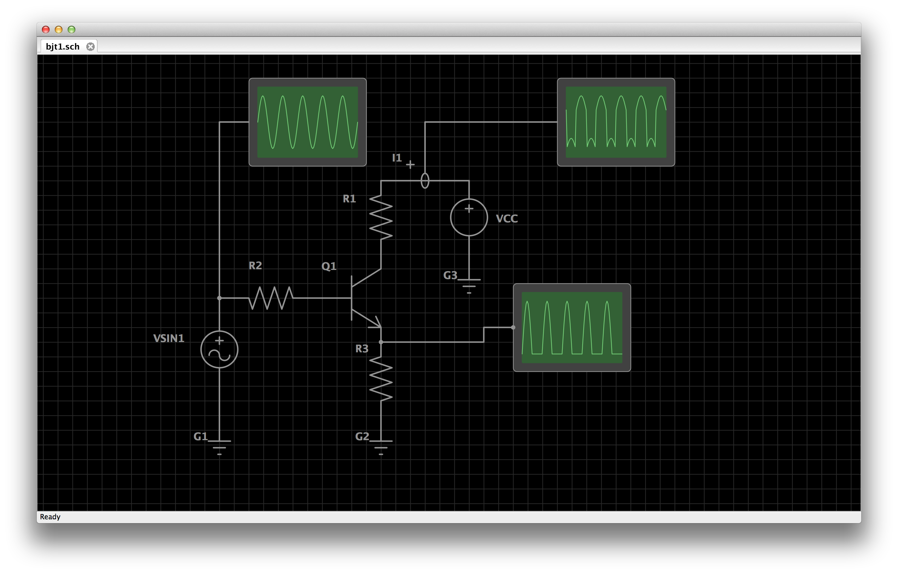
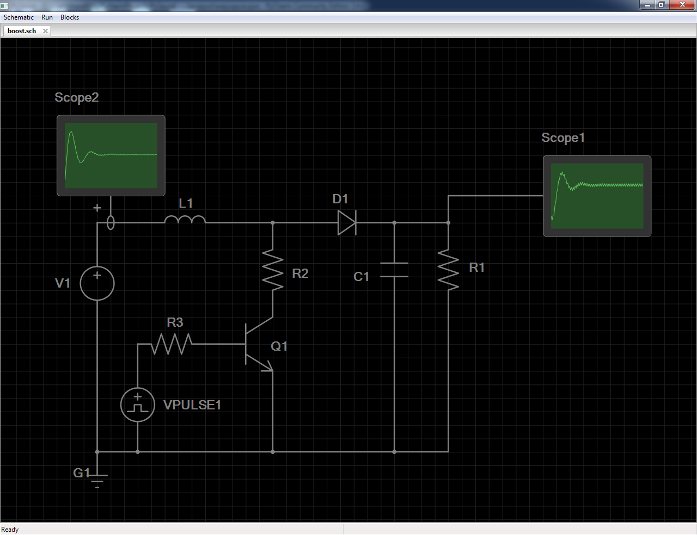
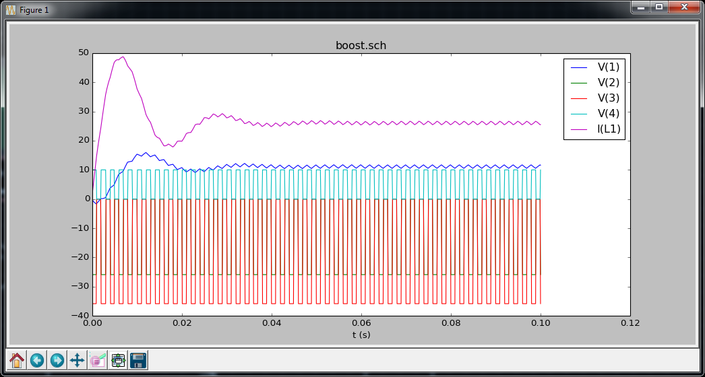
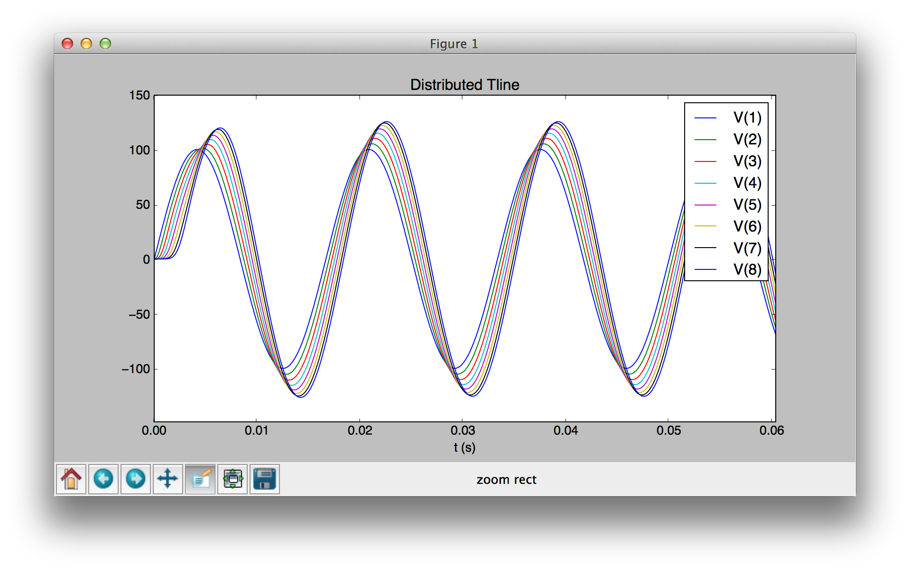

 SubCircuit: A Python Based Circuit Simulator
=========================





Requires Python 2.7, Scipy Stack and wxPython.

*Note: Many devices are not yet implemented. This is currently at a proof-of-concept phase. The devices and circuits shown in these examples are all currently supported and working.*

I'm looking for someone with Python and EE experience to help develop the rest of the atomic SPICE elements.


##Graphical and Programmatic Netlist Creation and Simulation

PySpyce allows the creation of netlists through a schematic editor or directly with a Python script.


###Graphical Example:###

On a Mac:



On Windows:



Plotting:



###Programmatic Netlist Development:###

```python
netlist = Netlist("Distributed Tline")

# define section subckt:
section = netlist.subckt('section', Subckt((1, 2)))
section.device('L', L((1, 2), 0.001))
section.device('C', C((2, 0), 0.0001))

# source:
netlist.device('V1', V((1, 0), Sin(0.0, 100.0, 60.0)))

# add 6 sections:
for i in range(1, 8):
    name = "X{0}".format(i)
    netlist.device(name, X((i, i+1), subckt='section'))

# load:
netlist.device('R1', R((8, 0), 5.0))

# transient simulation:
netlist.trans(0.0001, 0.1)

# plot all voltages:
voltages = []
for i in range(1, 9):
    voltages.append(Voltage(i))

netlist.plot(*voltages)
```



###Or Build Netlists Just As You Would in SPICE:###

```python
# SPICE Netlist:

""" 
Example Transformer
VIN 1 0 SIN(0 170 60 0 0)
L1 1 0 2000
L2 2 0 200
K1 L1 L2 0.99999
RL 2 0 500
.TRAN 0.2M 25M
.PLOT TRAN V(1)
.PLOT TRAN V(2)
.END
"""

# Equivalent Subcircuit Netlist:

netlist = Netlist("Example Transformer")
netlist.device("V1N", V((1, 0), Sin(0, 170, 60, 0, 0)))
netlist.device("L1", L((1, 0), 2000))
netlist.device("L2", L((2, 0), 200))
netlist.device("K1", K('L1', 'L2', 0.99999))
netlist.device("RL", R((2, 0), 500.0))
netlist.trans(0.00002, 0.025)
netlist.plot(Voltage(1), Voltage(2))
```

    def get_current_node(self):
        return self.port2node[2]
```

